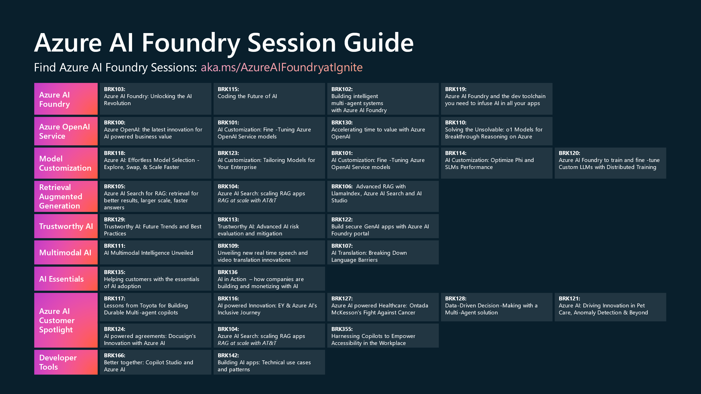

# Azure AI @ MS Ignite 2024
A one-stop shop for everything Azure AI at MS Ignite!
## Top Resources

### Book of News
[Ignite Book of News - Announcement summary](https://news.microsoft.com/ignite-2024-book-of-news/)

### Samples
- Kickstart your building with an AI template from our [AI Templates Gallery](https://azure.github.io/ai-app-templates/) released at GitHub Universe!
### Reading
- Checkout our [AI Platform blog](https://techcommunity.microsoft.com/t5/ai-ai-platform-blog/bg-p/AIPlatformBlog) for the latest from Azure AI platform
### Plans on Microsoft Learn 
*Plans are the recommended next step for all keynote, breakout, lab, and theatre sessions.These plans will be updated on a regular basis to ensure accurate and up-to-date information.*
- [Start transforming your business with AI](https://aka.ms/StartTransformingBizAI)
- [Accelerate generative AI model selection, evaluation, and multimodal integration](https://aka.ms/ADAI_OptlGenAIMod_Plan)
- [Evolve with generative AI: Operationalize your AI solutions with fine-tuning and prompt flow](https://aka.ms/ADAI_OpGenAISols_Plan)
- [Implementing data integration and model grounding with Azure AI Studio and Microsoft Fabric](https://aka.ms/ADAI_DevGenAIExp_Plan)
### Product 
- Try [Azure AI Foundry](https://aka.ms/azureaistudio)!
- Try [GitHub Models](https://github.com/marketplace/models)!
### Find more announcements
Azure AI Foundry
- [Announcement blog](https://aka.ms/Ignite24/blog/AIStack)
- [AI Foundry Portal blog](https://aka.ms/AzureAIFoundryportalIgnite2024Blog)
- [AI Foundry SDK blog](https://aka.ms/AzureAIFoundrySDKAnnouncement)
- [Azure AI Agents Service](https://aka.ms/AzureAI_Agents_Blog)

Trustworthy AI
- [Benchmarking news](https://aka.ms/Ignite2024/GenAIBenchmarking)📊
- [Evaluation news](https://aka.ms/Ignite2024/GenAIEvaluations)📈
- [Monitoring news](https://aka.ms/Ignite2024/GenAIMonitoring)🔍
- [AI governance news](aka.ms/Ignite2024/AIreports)🏛️
### Notes
- **If you are on site** get your AI Badge in the Community Booth
- **If you are a partner** please consider filling out the [Azure AI Infrastructure partner survey](https://aka.ms/AzureInfra/AIPartnerFeedback) 

## Expert Meetup & resources

| Station # |   Topic     |  Resources   |
| --------- | ----------- | ------------ | 
| 1         |  Azure AI Model catalog | [Learn more](https://www.youtube.com/watch?v=cfkrgVJ40pQ&pp=ygUWYXp1cmUgYWkgbW9kZWwgY2F0YWxvZw%3D%3D)  |
| 2 & 3     |  Azure OpenAI Service | [Learn about GPT-4o Realtime for speech and audio](https://www.youtube.com/watch?v=n4R1LWvqa1k&pp=ygUUYXV6cmUgb3BlbmFpIHNlcnZpY2U%3D), [Weights & Biases integration](https://aka.ms/WBFineTuningCollaboration) |
| 4         |  Azure AI Agents Service  | [Azure AI Agents Service announcement blog](https://aka.ms/AzureAI_Agents_Blog) |
| 5         |  Azure AI Foundry | checkout the [docs](https://learn.microsoft.com/en-us/azure/ai-studio/) & [learn modules](https://learn.microsoft.com/en-us/plans/3nd0bokgng58no)! |
| 6         |  Azure AI Services | [Azure AI Multimodal Intelligence](https://aka.ms/mmi-launch-blog) | 
| 7         |  Trustworthy AI    | [Learn how Microsoft implements Trustworthy AI](https://www.youtube.com/watch?v=YrEeonwWZJU)|
| 8         |  Azure AI Search    | [Azure AI Search in ChatGPT and global scale apps](https://www.youtube.com/watch?v=NVp9jiMDdXc) | 
| Spotlight |  Azure AI            | | 

## Community Area Exec/Expert Meet-up Schedule

| Session Code | Date | Time | Executive | Topic Area |
| ------------ | ---  | ---  | ---------  | ---------- |
| COM1034 | November 19th | 12PM | Sarah Bird | Trustworthy AI | 
| COM1033 | November 20th | 10AM | Pablo Castro | Azure AI Search |
| COM1035 | November 20th | 4PM | Brendan Burns & Eric Boyd | Kubernetes and AI |

## Azure AI Session & Resources

### Day 1 - Tuesday, November 19th 
| Important Links   | Description |                   
| ------- | ---------------------------------------------------------------------------|
| [Day 1 - All AI sessions](https://ignite.microsoft.com/en-US/sessions/BRKFP372?source=sessions) | Session catalog sorted for all AI sessions on Day 1 at MS Ignite | 
### Day 2 - Wednesday, November 20th
| Important Links   | Description |
| ------- | ---------------------------------------------------------------------------|
| [Day 2 - All AI sessions](https://ignite.microsoft.com/en-US/sessions?day=2024-11-20&end=1439&filter=topic%2FlogicalValue%3EAI) |  Session catalog sorted for all AI sessions on Day 2 at MS Ignite |
### Day 3 - Thursday, November 21st
| Important Links   | Description |
| ------- | ---------------------------------------------------------------------------|
| [Day 3 - All AI sessions](https://ignite.microsoft.com/en-US/sessions?day=2024-11-21&end=1439&filter=topic%2FlogicalValue%3EAI) |  Session catalog sorted for all AI sessions on Day 3 at MS Ignite |
### Day 4 - Friday, November 22nd
| Important Links   | Description |
| ------- | ---------------------------------------------------------------------------|
| [Day 4 - All AI sessions](https://ignite.microsoft.com/en-US/sessions?day=2024-11-22&end=1259&filter=topic%2FlogicalValue%3EAI) |  Session catalog sorted for all AI sessions on Day 4 at MS Ignite |

## Workshops Resources 

### PreDay- Monday, November 18th 
| Important Links   | Description |                   
| ------- | ---------------------------------------------------------------------------|
| [Pre016 Hands on Workshop](https://aka.ms/ignite/pre016) | Unlocking NLP Potential: Fine-Tuning with Microsoft Olive  | 
### Day 3,4/5 - Wednesday 20th, Thursday 21st and Friday 22nd November
| Important Links   | Description |
| ------- | ---------------------------------------------------------------------------|
| [Lab403](./decks/LAB403-IGNITE2024.pdf) |  Unlock AI Potential with Fine-Tuning Strategies for SLMs and LLMs with Azure AI Foundry |

## Microsoft AI Discord Community 

Join the Microsoft AI Discord community 

## Trademarks

This project may contain trademarks or logos for projects, products, or services. Authorized use of Microsoft 
trademarks or logos is subject to and must follow 
[Microsoft's Trademark & Brand Guidelines](https://www.microsoft.com/en-us/legal/intellectualproperty/trademarks/usage/general).
Use of Microsoft trademarks or logos in modified versions of this project must not cause confusion or imply Microsoft sponsorship.
Any use of third-party trademarks or logos are subject to those third-party's policies.
